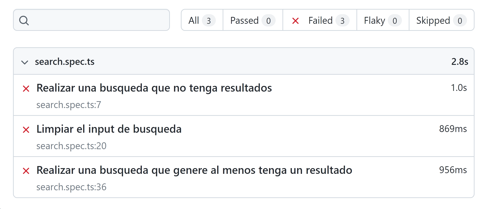
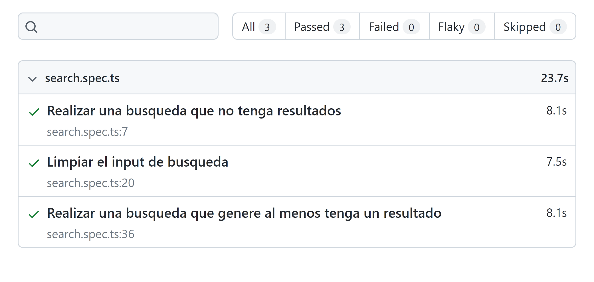

# Reto#2 Repara los tests

En este reto vas a encontrar tests que en este momento no funcionan, tu misión repararlos para que vuelvan a funcionar

- [Instalación](#instalación)
- [Pruebas](#pruebas)
- [Como enviar tu solución](#como-enviar-tu-solución)
- [Licencia](#licencia)
- [Credits](#credits)

## Instalación

1. Hacer el fork de este proyecto en tu espacio personal
1. Clonar el repositorio desde tu espacio personal en tu computadora
1. Instalar dependencias, con el comando `npm install`
1. Inicializar el repositorio como un proyecto de playwright
`npx playwright install`

## Pruebas

Las pruebas end to end corren bajo playwright con el comando `npx playwright test` y ya esta incluido como parte de las dependencias del proyecto, sin embargo, antes de correr el comando, asegúrate de correr `npm install` para instalar los requerimientos de playwright para correr pruebas.

Cuando corras el comando `npx playwright test` por primera vez las pruebas van a fallar y se verán así:

Una vez repares todos los tests deberías pasar todas las pruebas y se verán así:

> Puedes ir corriendo el comando `npx playwright test` de las funcionalidades que vayas creando para ir evaluando que vas por buen camino.

## Como enviar tu solución

Debes de hacer un "Fork" de este proyecto, revolver los problemas y crear un Pull Request hacia este repositorio.

## Licencia

Este proyecto se lanza bajo la licencia [MIT](https://opensource.org/licenses/MIT).
